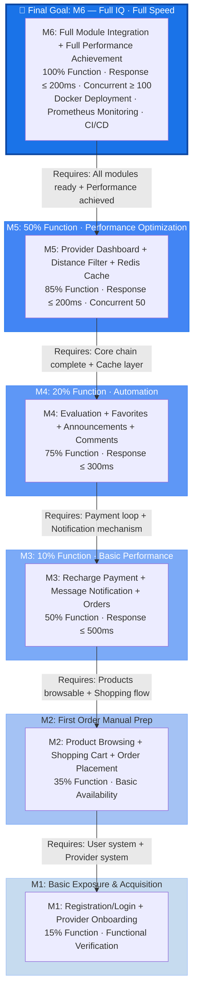
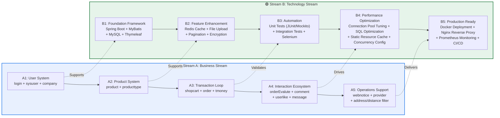
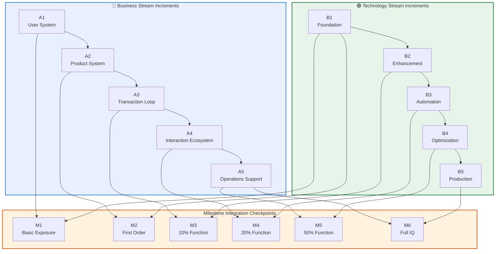
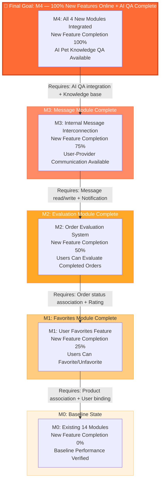
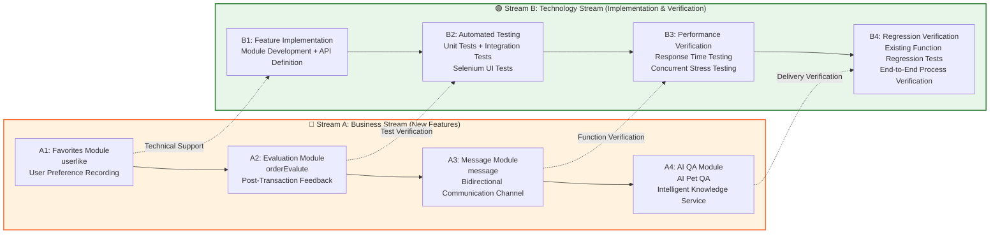
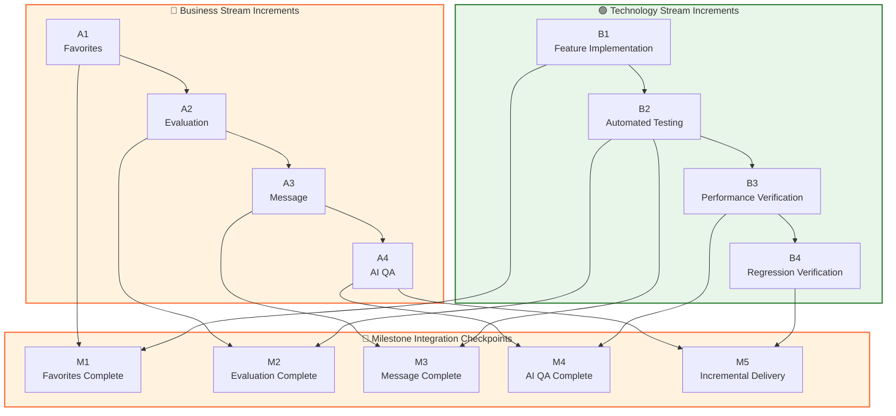

# Pet Service Platform — Incremental Integration Sequence Definition

> This document applies the **Incremental Integration Sequence** methodology from systems engineering to the Pet Service Platform project, defining integration increments from baseline to full capability.

---

# Version 1: Full System Integration (Greenfield Development Scenario)

> ⚠️ **Important Note**: This version applies to **building the entire system from scratch**
> - Total of **14 business modules** to be integrated
> - KPP metrics measure coverage across all 14 modules
>
> For comparison with Version 2 (incremental development on existing system), see below.

---

## I. KPP (Key Performance Parameters) Definition

This project adopts a **dual-dimension KPP** approach:

| Dimension | KPP Metric | Meaning |
|-----------|------------|---------|
| **Business Function Coverage** | Number of integrated and verified business modules / Total modules (14) | Measures functional completeness |
| **System Performance Metrics** | Response time ≤ 200ms, Concurrent support ≥ 100, Availability ≥ 99% | Measures system readiness |

---

## II. Figure 1: Top-Level KPP & Key Functionality Milestones (Timeline)

> Left to right, progressing over time. Each milestone indicates business coverage and performance achievement.

```mermaid
gantt
    title Pet Service Platform — Incremental Integration Milestone Timeline
    dateFormat  YYYY-MM-DD
    axisFormat  %m/%d

    section M1: Basic Exposure
    User registration/login available        :m1a, 2025-09-01, 5d
    Service provider onboarding available    :m1b, after m1a, 5d
    Milestone: Basic Exposure & Acquisition  :milestone, m1, after m1b, 0d

    section M2: First Order Manual Prep
    Product/service browsing & search        :m2a, after m1, 7d
    Shopping cart (manual order)             :m2b, after m2a, 5d
    Order creation (manual process)          :m2c, after m2b, 5d
    Milestone: First Order Manual Prep       :milestone, m2, after m2c, 0d

    section M3: 10% Function + Basic Performance
    Recharge & balance payment               :m3a, after m2, 5d
    Internal message notification            :m3b, after m3a, 3d
    Milestone: 10% Function · Basic Perf     :milestone, m3, after m3b, 0d

    section M4: 20% Function + Automation
    Order evaluation system                  :m4a, after m3, 5d
    User favorites feature                   :m4b, after m4a, 3d
    Website announcements & comments         :m4c, after m4b, 3d
    Milestone: 20% Function · Automation     :milestone, m4, after m4c, 0d

    section M5: 50% Function + Performance Optimization
    Service provider dashboard               :m5a, after m4, 7d
    Address selection & distance filtering   :m5b, after m5a, 5d
    Performance optimization (Redis/cache)   :m5c, after m5b, 5d
    Milestone: 50% Function · Perf Opt       :milestone, m5, after m5c, 0d

    section M6: Full IQ · Full Speed
    Full module integration testing          :m6a, after m5, 7d
    Automated test coverage                  :m6b, after m6a, 5d
    Docker containerized deployment          :m6c, after m6b, 5d
    Monitoring alerts (Prometheus)           :m6d, after m6c, 3d
    Milestone: Full IQ · Full Speed          :milestone, m6, after m6d, 0d
```

### Milestone KPP Achievement Table

| Milestone | Business Function Coverage | Performance Achievement | Integrated Modules |
|-----------|---------------------------|------------------------|-------------------|
| **M1: Basic Exposure & Acquisition** | ~15% (2/14) | N/A (functional verification phase) | login, sysuser, company |
| **M2: First Order Manual Prep** | ~35% (5/14) | Basic availability | + product, producttype, shopcart |
| **M3: 10% Function · Basic Performance** | ~50% (7/14) | Response ≤ 500ms | + order, tmoney, message |
| **M4: 20% Function · Automation** | ~75% (11/14) | Response ≤ 300ms | + orderEvalute, userlike, webnotice, comment |
| **M5: 50% Function · Performance Optimization** | ~85% (12/14) | Response ≤ 200ms, Concurrent 50 | + provider, address/distance features |
| **M6: Full IQ · Full Speed** | **100% (14/14)** | **Response ≤ 200ms, Concurrent ≥ 100, Availability ≥ 99%** | + Full integration testing, Docker deployment, Prometheus monitoring |

---

## III. Figure 2: Demand-Driven Backward Planning

> Working backward from the final goal (M6: Full IQ / Full Speed), decomposing into verifiable integration increments.



### Backward Planning Logic

```
M6 (Full IQ / Full Speed)
  └─ Prerequisite: M5 all modules integrated + Performance bottlenecks identified
       └─ Prerequisite: M4 extended features integrated (evaluation/favorites/announcements/comments)
            └─ Prerequisite: M3 payment loop established (recharge → balance → order → notification)
                 └─ Prerequisite: M2 products browsable, shopping cart available, orders creatable
                      └─ Prerequisite: M1 users can register, providers can onboard
```

**Core Principle**: Each increment can only proceed to the next after all verification of its prerequisite increments passes.

---

## IV. Figure 3: Dual-Stream Incremental Breakdown

> **Stream A — Business Stream**: Decomposed by core business chain functional stages
> **Stream B — Technology Stream**: Decomposed by system capability building stages



### Dual-Stream to Milestone Mapping



---

## V. Detailed Verification Criteria by Increment

### M1: Basic Exposure & Acquisition

| Verification Item | Business Stream (A1) | Technology Stream (B1) |
|-------------------|---------------------|------------------------|
| Integration Content | User registration/login, provider onboarding | Spring Boot + MyBatis + MySQL + Thymeleaf setup complete |
| Verification Criteria | Users can register 3 roles (regular user/admin/provider); providers can complete company info | Database connection normal; pages renderable; MyBatis Mapper can execute CRUD |
| KPP | Function Coverage 15% | Foundation framework ready |

### M2: First Order Manual Prep

| Verification Item | Business Stream (A1+A2) | Technology Stream (B1) |
|-------------------|------------------------|------------------------|
| Integration Content | Product/service browsing, category filtering, shopping cart, manual order creation | Thymeleaf template rendering, static resource loading |
| Verification Criteria | Users can browse services published by providers; can add to cart; can manually submit orders | Pages load normally; frontend frameworks (Bootstrap/LayUI) integrated |
| KPP | Function Coverage 35% | Pages interactive |

### M3: 10% Function · Basic Performance

| Verification Item | Business Stream (A1+A2+A3) | Technology Stream (B1+B2) |
|-------------------|---------------------------|---------------------------|
| Integration Content | Recharge application/approval, balance payment, automatic order notification | Redis cache integration, file upload, pagination plugin |
| Verification Criteria | Complete payment loop: recharge → balance → order → deduction → notify provider | Redis read/write normal; file upload available; pagination queries correct |
| KPP | Function Coverage 50% | Response time ≤ 500ms |

### M4: 20% Function · Automation

| Verification Item | Business Stream (A1~A4) | Technology Stream (B1~B3) |
|-------------------|------------------------|---------------------------|
| Integration Content | Order evaluation, user favorites, website announcements, announcement comments | JUnit unit tests, Mockito, integration tests, Selenium |
| Verification Criteria | Users can evaluate completed orders; can favorite services; can view announcements and comment | Core module test coverage ≥ 60%; Selenium smoke tests pass |
| KPP | Function Coverage 75% | Response time ≤ 300ms |

### M5: 50% Function · Performance Optimization

| Verification Item | Business Stream (A1~A5) | Technology Stream (B1~B4) |
|-------------------|------------------------|---------------------------|
| Integration Content | Provider dashboard, address selection, distance filtering | Connection pool tuning, SQL optimization, Nginx static cache, concurrency config |
| Verification Criteria | Providers can view business data (orders/ratings/revenue); users can filter services by distance | 50 concurrent users without errors; slow queries optimized; static resource cache effective |
| KPP | Function Coverage 85% | Response time ≤ 200ms; Concurrent 50 |

### M6: Full IQ · Full Speed

| Verification Item | Business Stream (A1~A5 All) | Technology Stream (B1~B5 All) |
|-------------------|----------------------------|------------------------------|
| Integration Content | Full module end-to-end integration | Docker deployment, Nginx reverse proxy, Prometheus monitoring, GitHub Actions CI/CD |
| Verification Criteria | All business processes end-to-end pass; no P0/P1 defects | Docker Compose one-click startup; Prometheus metrics collectable; CI/CD pipeline passes |
| KPP | **Function Coverage 100%** | **Response ≤ 200ms; Concurrent ≥ 100; Availability ≥ 99%** |

---

## VI. ASCII Architecture Diagrams (No Mermaid Rendering Required)

### Figure 1: Top-Level Milestone Timeline

```
Time ─────────────────────────────────────────────────────────────────────────▶

M1            M2              M3              M4              M5              M6
Basic         First           10%             20%             50%             Full IQ
Exposure      Order           Function        Function        Function        Full Speed
& Acq         Manual          + Basic         + Auto          + Perf          
              Prep            Perf                            Opt             
│             │               │               │               │               │
▼             ▼               ▼               ▼               ▼               ▼
┌─────┐     ┌─────┐        ┌─────┐        ┌─────┐        ┌─────┐        ┌─────┐
│15%  │     │35%  │        │50%  │        │75%  │        │85%  │        │100% │
│Func │────▶│Func │───────▶│Func │───────▶│Func │───────▶│Func │───────▶│Func │
│     │     │Basic│        │≤500ms│       │≤300ms│       │≤200ms│       │≤200ms│
│     │     │Avail│        │     │        │Auto │        │Conc50│       │Conc100│
└─────┘     └─────┘        └─────┘        └─────┘        └─────┘        └─────┘
 login      +product       +order         +Eval/Fav      +Dashboard     Full Integration
 sysuser    producttype    tmoney         +Ann/Comm      +Distance      Docker
 company    shopcart       message                                       Prometheus
```

### Figure 2: Backward Planning Diagram

```
                    ┌─────────────────────────────┐
                    │  M6: Full IQ · Full Speed   │  ◀── Final Goal
                    │  100% Function · Full Perf  │
                    └──────────────┬──────────────┘
                                   │
                          Requires: All modules ready + Performance achieved
                                   │
                    ┌──────────────▼──────────────┐
                    │  M5: 50% Function · Perf Opt │
                    │  85% Function · ≤200ms · C50 │
                    └──────────────┬──────────────┘
                                   │
                          Requires: Core chain complete + Cache layer
                                   │
                    ┌──────────────▼──────────────┐
                    │  M4: 20% Function · Auto     │
                    │  75% Function · ≤300ms · Auto│
                    └──────────────┬──────────────┘
                                   │
                          Requires: Payment loop + Notification mechanism
                                   │
                    ┌──────────────▼──────────────┐
                    │  M3: 10% Function · Basic    │
                    │  50% Function · ≤500ms       │
                    └──────────────┬──────────────┘
                                   │
                          Requires: Products browsable + Shopping flow
                                   │
                    ┌──────────────▼──────────────┐
                    │  M2: First Order Manual Prep │
                    │  35% Function · Basic Avail  │
                    └──────────────┬──────────────┘
                                   │
                          Requires: User system + Provider system
                                   │
                    ┌──────────────▼──────────────┐
                    │  M1: Basic Exposure & Acq   │
                    │  15% Function · Func Verify │
                    └─────────────────────────────┘
```

### Figure 3: Dual-Stream Incremental Breakdown

```
  🔵 Stream A: Business                  🟢 Stream B: Technology
  (Business Stream)                      (Technology Stream)
  ─────────────────                      ────────────────────

  ┌──────────────┐                       ┌──────────────┐
  │ A1: User     │                       │ B1: Foundation│
  │    System    │◄───── Supports ──────│ Spring Boot  │
  │ login        │                       │ MyBatis      │
  │ sysuser      │                       │ MySQL        │
  │ company      │                       └──────┬───────┘
  └──────┬───────┘                              │
         │                                      │
         ▼                                      ▼
  ┌──────────────┐                       ┌──────────────┐
  │ A2: Product  │                       │ B2: Feature  │
  │    System    │◄───── Supports ──────│ Enhancement  │
  │ product      │                       │ Redis Cache  │
  │ producttype  │                       │ File Upload  │
  └──────┬───────┘                       │ Paging/Crypto│
         │                               └──────┬───────┘
         ▼                                      │
  ┌──────────────┐                       ┌──────────────┐
  │ A3: Transac  │                       │ B3: Automation│
  │    Loop      │◄───── Validates ─────│ JUnit/Mockito│
  │ shopcart     │                       │ Integration  │
  │ order        │                       │ Selenium     │
  │ tmoney       │                       └──────┬───────┘
  │ message      │                              │
  └──────┬───────┘                              ▼
         ▼                               ┌──────────────┐
  ┌──────────────┐                       │ B4: Perf Opt │
  │ A4: Interact │◄───── Drives ────────│ Pool Tuning  │
  │    Ecosystem │                       │ SQL Optimize │
  │ orderEvalute │                       │ Static Cache │
  │ comment      │                       │ Concurrency  │
  │ userlike     │                       └──────┬───────┘
  └──────┬───────┘                              │
         │                                      │
         ▼                                      ▼
  ┌──────────────┐                       ┌──────────────┐
  │ A5: Operatns │◄───── Delivers ──────│ B5: Production│
  │    Support   │                       │ Docker       │
  │ webnotice    │                       │ Nginx        │
  │ provider     │                       │ Prometheus   │
  │ Address/Dist │                       │ CI/CD        │
  └──────────────┘                       └──────────────┘

  ══════════════════════════════════════════════════════════════
  Milestone Mapping:
  M1 = A1 + B1     M2 = A1+A2 + B1    M3 = A1~A3 + B1~B2
  M4 = A1~A4 + B1~B3   M5 = A1~A5 + B1~B4   M6 = A1~A5 + B1~B5
```

---

## VII. Mapping to Original Framework (Version 1)

| Original Framework Concept | Version 1 Mapping |
|---------------------------|-------------------|
| Imaging stream | **Business Stream**: Decomposed by core business chain |
| Control & performance stream | **Technology Stream**: Decomposed by system capability building |
| IQ (Image Quality) | **Business Function Coverage**: Integrated modules / 14 total modules |
| Speed | **System Performance Metrics**: Response time, concurrency, availability |
| functioning exposure and acquisition | **M1: Basic Exposure & Acquisition** (registration/login/onboarding) |
| First image manual preparation | **M2: First Order Manual Prep** (browsing/shopping cart/manual order) |
| 10% IQ manual preparation (10% speed) | **M3: 10% Function · Basic Performance** (payment loop/notification/≤500ms) |
| 20% IQ automated preparation (10% speed) | **M4: 20% Function · Automation** (evaluation/favorites/announcements/automated testing) |
| 50% IQ automated preparation (100% speed) | **M5: 50% Function · Performance Optimization** (dashboard/distance filter/concurrent 50) |
| Full IQ Full speed | **M6: Full IQ · Full Speed** (100% function/full performance/Docker/monitoring) |

---

# Version 2: Incremental Integration for 4 New Feature Modules (Incremental Development Scenario)

> ⚠️ **Important Note**: This version applies to **incremental development on existing system**
> - Project has **14 existing business modules** already implemented
> - This incremental development adds **4 new feature modules**
> - Therefore KPP metrics should **only target these 4 new modules**, not the entire system
>
> Comparison with Version 1:
> - Version 1 (above): For greenfield full system development
> - Version 2 (below): For adding features to existing system

---

## I. New Module Description

| No. | Feature Module | English Name | Status | Description |
|-----|---------------|--------------|--------|-------------|
| 1 | User Favorites | Userlike | ✅ Implemented | Users can favorite services of interest |
| 2 | Order Evaluation | OrderEvalute | ✅ Implemented | Users can evaluate service providers after order completion |
| 3 | Customer-Provider Communication | Message | ✅ Implemented | Internal messaging system supporting user-provider communication |
| 4 | AI Pet Knowledge Q&A | AI Pet QA | ❌ Pending | AI-based pet knowledge question answering feature |

---

## II. KPP (Key Performance Parameters) Redefinition

### Problem with Version 1
Version 1's KPP counted "coverage across all 14 system modules", which is correct for **greenfield full system development**. But for incremental development only, using 14 modules as denominator masks the true incremental value.

### Correct KPP Definition (Version 2) — Incorporating Uncertainty

Teacher's requirement: KPP should reflect **uncertainties encountered from current state to target completion**.

Therefore, KPP needs to include **uncertainty dimensions**, reflecting risk levels and verification status at each increment stage.

#### Uncertainty Source Analysis

| Uncertainty Type | Description | Manifestation in This Project |
|-----------------|-------------|------------------------------|
| **Requirements Uncertainty** | Whether requirements are clear, whether they will change | Whether AI QA knowledge scope boundaries are clear |
| **Technical Uncertainty** | Whether technical solution is feasible, whether there are unknown difficulties | AI interface stability, whether response time meets standards |
| **Integration Uncertainty** | Compatibility with existing systems, interface conflict risks | Data consistency between new modules and existing 14 modules |
| **Schedule Uncertainty** | Workload estimation accuracy, dependency delay risks | Whether AI module development cycle is controllable |

#### Improved KPP Definition

| KPP Dimension | KPP Metric | Meaning | Uncertainty Manifestation |
|---------------|------------|---------|--------------------------|
| **Function Completion** | Implemented functions / Planned functions | Technical implementation progress | Uncertainty exists from "implemented" to "verified" |
| **Requirements Certainty** | Confirmed requirements / Total requirements | Requirements stability | Early requirements may change, later gradually converge |
| **Technical Risk Level** | High/Medium/Low risk | Implementation difficulty assessment | AI module has highest risk, favorites/evaluation have lower risk |
| **Integration Verification Status** | Unverified/Partially verified/Fully verified | Compatibility with existing system | Each increment needs regression testing, uncertainty exists |
| **Performance Achievement Rate** | Measured performance / Target performance | System performance maintenance | New features may introduce performance degradation risk |

---

## III. Figure 1 (Version 2): New Module Milestone Timeline

> Left to right, progressing over time. Each milestone indicates new feature completion and performance status.

```mermaid
gantt
    title Pet Service Platform — New Module Incremental Integration Milestones
    dateFormat  YYYY-MM-DD
    axisFormat  %m/%d

    section M1: Favorites Module
    User favorites feature integration      :m1a, 2025-10-01, 7d
    Favorites list page & interaction       :m1b, after m1a, 5d
    Milestone: Favorites Module Complete    :milestone, m1, after m1b, 0d

    section M2: Evaluation Module
    Order evaluation feature integration    :m2a, after m1, 7d
    Provider rating statistics              :m2b, after m2a, 5d
    Milestone: Evaluation Module Complete   :milestone, m2, after m2b, 0d

    section M3: Message Module
    Internal message send/receive           :m3a, after m2, 7d
    User-provider message interconnection   :m3b, after m3a, 5d
    Milestone: Message Module Complete      :milestone, m3, after m3b, 0d

    section M4: AI Pet QA
    AI QA API integration                   :m4a, after m3, 10d
    Pet knowledge base construction         :m4b, after m4a, 7d
    Frontend QA interface integration       :m4c, after m4b, 5d
    Milestone: AI QA Module Complete        :milestone, m4, after m4c, 0d

    section M5: Full Integration Verification
    End-to-end regression testing           :m5a, after m4, 7d
    Performance regression testing          :m5b, after m5a, 5d
    Milestone: Incremental Delivery         :milestone, m5, after m5b, 0d
```

### New Module Milestone KPP Achievement Table (With Uncertainty Dimensions)

| Milestone | Function Completion | Requirements Certainty | Technical Risk | Integration Verification | Performance Achievement | Uncertainty Description |
|-----------|--------------------|------------------------|----------------|-------------------------|------------------------|------------------------|
| **M0: Baseline State** | 0% (0/4) | 100% | None | Verified | 100% | Existing system is stable, lowest uncertainty |
| **M1: Favorites Module Complete** | 25% (1/4) | 100% | 🟢 Low | Verified | 100% | Simple function, clear coupling with existing product module, low uncertainty |
| **M2: Evaluation Module Complete** | 50% (2/4) | 100% | 🟢 Low | Verified | 100% | Rating algorithm determined, but need to verify rating statistics accuracy |
| **M3: Message Module Complete** | 75% (3/4) | 95% | 🟡 Medium | Verified | 100% | Real-time push mechanism has technical uncertainty; message storage growth risk |
| **M4: AI QA Module Complete** | 100% (4/4) | 70% | 🔴 High | Partially Verified | Pending | **Highest uncertainty**: AI interface stability unknown; knowledge base boundaries unclear; response time may not meet standards |
| **M5: Incremental Delivery** | **100%** | **100%** | **None** | **Fully Verified** | **≥95%** | All uncertainties have converged through testing, system reaches deliverable state |

#### Uncertainty Trend Visualization

```
Uncertainty Level
    │
High│                    ┌───┐
    │                    │M4 │ AI Module: Requirements uncertain (70%), High technical risk
    │                ┌───┤   │
 Med│            ┌───┤M3 │   │ Message Module: Real-time push technical uncertainty
    │        ┌───┤   └───┤   │
 Low│    ┌───┤M2 │       └───┤
    │┌───┤   └───┤           │
None│M0 │M1 │   │           │
    └───┴───┴───┴───────────┘
    Baseline Fav Eval Msg    AI    Delivery
                    Function Completion ──────▶
```

**Key Insights**:
- **M0→M3**: Uncertainty is relatively low because functions are standard and technical solutions are mature
- **M4**: Uncertainty **spikes sharply** because AI module involves external dependencies (AI interface) and fuzzy requirements (knowledge boundaries)
- **M5**: Uncertainty **converges to acceptable level** through sufficient testing

---

## IV. Figure 2 (Version 2): Demand-Driven Backward Planning

> Working backward from the final goal (M4: all 4 new modules online), decomposing into integration increments.



### Backward Planning Logic (Version 2)

```
M4 (New Features 100% + AI QA Complete)
  └─ Prerequisite: M3 message module complete + communication channel available
       └─ Prerequisite: M2 evaluation module complete + rating mechanism ready
            └─ Prerequisite: M1 favorites module complete + user preferences recordable
                 └─ Prerequisite: M0 existing 14 modules baseline verification passed
```

---

## V. Figure 3 (Version 2): Dual-Stream Incremental Breakdown

> **Stream A — Business Stream**: Decomposed by new feature business value chain
> **Stream B — Technology Stream**: Decomposed by new feature implementation and verification stages



### Dual-Stream to Milestone Mapping (Version 2)



---

## VI. Detailed Verification Criteria by Increment (Version 2)

### M0: Baseline State

| Verification Item | Description |
|-------------------|-------------|
| Integration Content | Existing 14 business modules (login, sysuser, company, product, producttype, order, shopcart, tmoney, provider, webnotice, comment, type, common, web) |
| Verification Criteria | Core business processes (registration → browsing → ordering → payment → viewing orders) end-to-end pass |
| KPP | New Feature Completion 0%; Existing Function Verification Rate 100% |

### M1: Favorites Module Complete

| Verification Item | Business Stream (A1) | Technology Stream (B1) |
|-------------------|---------------------|------------------------|
| Integration Content | Users can favorite/unfavorite products; favorites list display | Favorites module unit tests pass; integration tests pass |
| Verification Criteria | User clicks favorite and data correctly stored; unfavorite updates list; no conflicts with product module | Favorites related APIs respond normally; existing functions have no regression |
| KPP | New Feature Completion 25% (1/4) | Existing performance maintained |

### M2: Evaluation Module Complete

| Verification Item | Business Stream (A2) | Technology Stream (B1+B2) |
|-------------------|---------------------|---------------------------|
| Integration Content | Users can evaluate after order completion; provider ratings auto-update | Evaluation module automated test coverage; Selenium UI tests pass |
| Verification Criteria | Completed orders show evaluation entry; rating statistics update after submission; evaluation list displays correctly | Evaluation related APIs respond normally; rating calculation logic correct; existing functions have no regression |
| KPP | New Feature Completion 50% (2/4) | Existing performance maintained |

### M3: Message Module Complete

| Verification Item | Business Stream (A3) | Technology Stream (B2) |
|-------------------|---------------------|------------------------|
| Integration Content | Users can send messages to providers; providers can reply; message notifications | Message module automated test coverage; real-time message push verification |
| Verification Criteria | User-provider bidirectional message interconnection; unread message marking; message list pagination correct | Message APIs respond normally; push mechanism works normally; existing functions have no regression |
| KPP | New Feature Completion 75% (3/4) | Existing performance maintained |

### M4: AI QA Module Complete — Highest Uncertainty Increment

| Verification Item | Business Stream (A4) | Technology Stream (B2+B3) |
|-------------------|---------------------|---------------------------|
| Integration Content | AI pet knowledge Q&A; pet knowledge base; QA interface | AI QA API tests; performance tests |
| Verification Criteria | User asks question and AI returns relevant answer; answer content matches pet knowledge theme; QA response time ≤ 3 seconds | AI API availability 99%; response time ≤ 3 seconds; existing functions have no regression |
| KPP | New Feature Completion 100% (4/4) | New feature performance achieved |

#### M4 Uncertainty Detailed Analysis

| Uncertainty Type | Risk Description | Mitigation Measure | Verification Method |
|-----------------|------------------|-------------------|---------------------|
| **Requirements Uncertainty** | AI knowledge boundaries unclear: which pet questions can be answered? How to handle medical advice? | Define knowledge scope checklist; set disclaimer | Requirements review meeting; boundary test cases |
| **Technical Uncertainty** | AI interface response time unstable; API rate limiting/failure | Implement local cache; fallback strategy (return default prompt) | Stress testing; fault injection testing |
| **Integration Uncertainty** | AI module coupling with existing user system; data format incompatibility | Define clear API contract; data transformation layer | Interface contract testing; integration testing |
| **Schedule Uncertainty** | AI knowledge base construction workload hard to estimate; tuning cycle long | Phased delivery: general knowledge first, professional knowledge later | Iterative development; weekly progress review |

**Risk Response Contingency Plans**:
- If AI interface is unstable → Switch to backup AI provider or downgrade to FAQ mode
- If response time does not meet standard → Introduce preloading and caching mechanism
- If knowledge base construction lags → Prioritize covering high-frequency questions, supplement others gradually

### M5: Incremental Delivery

| Verification Item | Business Stream (A1~A4 All) | Technology Stream (B1~B4 All) |
|-------------------|----------------------------|------------------------------|
| Integration Content | 4 new modules end-to-end integration | Complete test coverage + performance verification + regression tests |
| Verification Criteria | All new feature business processes end-to-end pass; no P0/P1 defects | Automated test coverage ≥ 80%; performance tests pass; regression tests pass |
| KPP | **New Feature Completion 100%** | **Existing performance maintained + new feature performance achieved** |

---

## VII. Version Comparison Table

| Comparison Dimension | Version 1 (Full System Integration) | Version 2 (Incremental Development) |
|---------------------|-------------------------------------|-------------------------------------|
| **Applicable Scenario** | Building entire system from scratch | Adding features to existing system |
| **Denominator Baseline** | 14 full system business modules | 4 new feature modules this time |
| **KPP Function Dimension** | Full system business function coverage | New feature completion rate |
| **Number of Milestones** | 6 (M1~M6) | 5 (M0~M4) + M5 delivery |
| **Technology Stream Focus** | Complete construction from foundation to production | New module test coverage and performance verification |
| **Business Stream Focus** | Complete chain from user system to operations support | Value increment from favorites to AI QA |

### Core Difference Illustration

```
Version 1 (Full System Integration):
┌─────────────────────────────────────────────────────────────┐
│  KPP = Integrated Modules / Total Modules (14)              │
│                                                             │
│  0% ────────────── 15% ────── 50% ────── 75% ─── 100%     │
│  (None)  M1 Basic  M2 First  M3 Payment M4 Extended M6 Full│
└─────────────────────────────────────────────────────────────┘

Version 2 (Incremental Development):
┌─────────────────────────────────────────────────────────────┐
│  KPP = Completed New Modules / Total New Modules (4)        │
│                                                             │
│  0% ───── 25% ────── 50% ────── 75% ────── 100%           │
│  (Baseline) M1 Fav  M2 Eval   M3 Msg   M4 AI              │
│                                                             │
│  Existing 14 Modules ───────────────────────────────────▶   │
│  (Already 100% complete, as baseline, not in KPP denominator)│
└─────────────────────────────────────────────────────────────┘
```

---

## VIII. Mapping to Original Framework (Version 2)

| Original Framework Concept | Version 2 Mapping |
|---------------------------|-------------------|
| Imaging stream | **Business Stream (New Features)**: Decomposed by new feature business value chain |
| Control & performance stream | **Technology Stream (Implementation & Verification)**: Decomposed by new feature technical implementation stages |
| IQ (Image Quality) | **New Feature Completion Rate**: Integrated new modules / 4 new modules |
| Speed | **System Performance Impact**: Impact of new features on existing system performance |
| functioning exposure and acquisition | **M1: Favorites Module Complete** (user preference recording feature) |
| First image manual preparation | **M2: Evaluation Module Complete** (post-transaction feedback mechanism) |
| 10% IQ manual preparation (10% speed) | **M3: Message Module Complete** (bidirectional communication channel establishment) |
| 20% IQ automated preparation (10% speed) | **M4: AI QA Module Implementation** (intelligent knowledge service online) |
| 50% IQ automated preparation (100% speed) | **M5: Performance Verification** (performance tests passed) |
| Full IQ Full speed | **Incremental Delivery**: 4 new modules 100% complete + performance achieved + regression tests passed |
