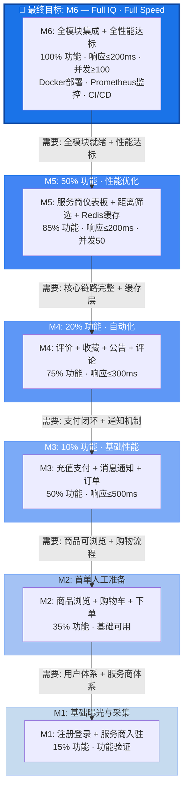
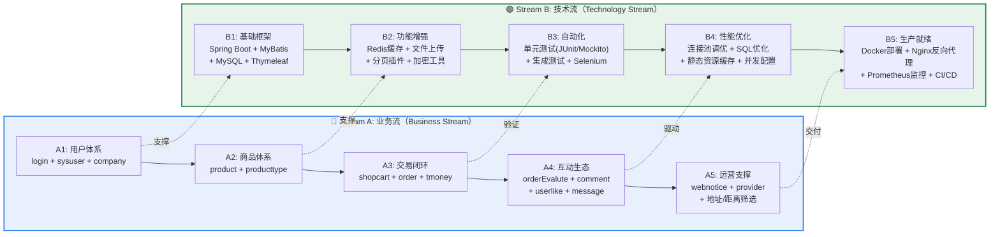
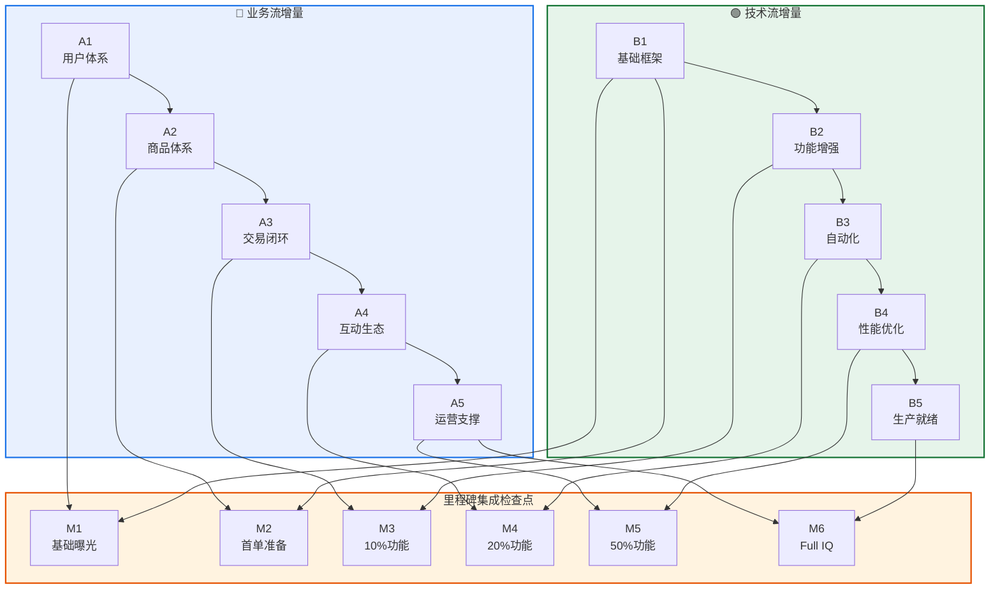
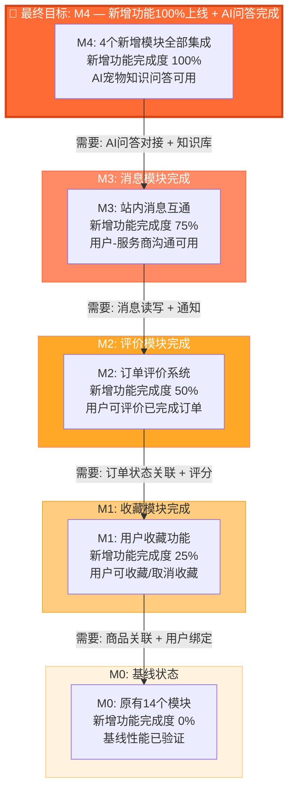
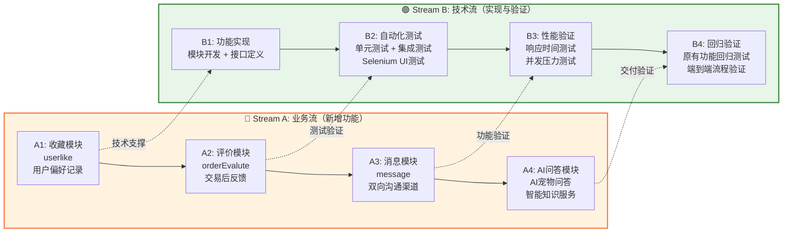
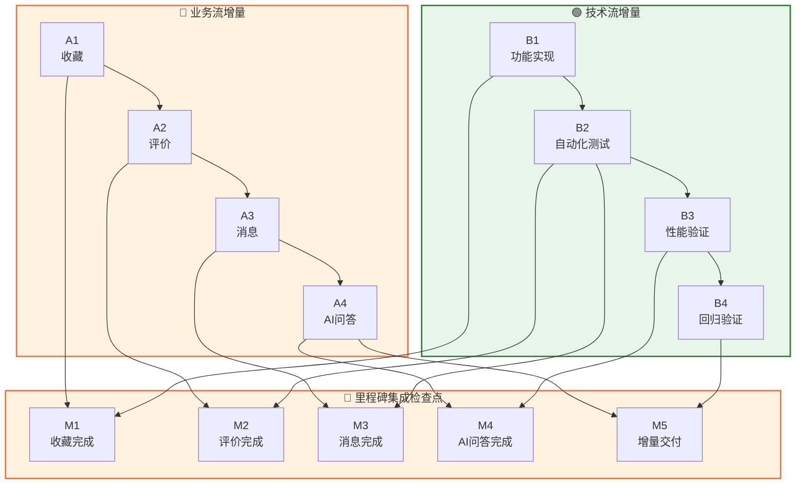

# 宠物服务平台 — 增量式集成顺序定义

> 本文档将系统工程中的 **Incremental Integration Sequence** 方法论
> 映射到宠物服务平台项目，定义从基础到完整的集成增量。

---

## 一、KPP（关键性能参数）定义

本项目采用**双维度 KPP**：

| 维度 | KPP 指标 | 含义 |
|------|---------|------|
| **业务功能覆盖率** | 已集成并通过验证的业务模块数 / 总模块数（14个） | 衡量功能完整度 |
| **系统性能指标** | 响应时间 ≤ 200ms、并发支持 ≥ 100、可用性 ≥ 99% | 衡量系统就绪度 |

---

## 二、图1：顶层 KPP & 关键功能里程碑（时间线图）

> 从左到右，随时间推进。每个里程碑标注业务覆盖率与性能达标率。

```mermaid
gantt
    title 宠物服务平台 — 增量式集成里程碑时间线
    dateFormat  YYYY-MM-DD
    axisFormat  %m/%d

    section M1: 基础曝光
    用户注册/登录功能可用        :m1a, 2025-09-01, 5d
    服务商入驻功能可用           :m1b, after m1a, 5d
    里程碑: 基础曝光与采集        :milestone, m1, after m1b, 0d

    section M2: 首单人工准备
    商品/服务浏览与搜索          :m2a, after m1, 7d
    购物车（手动下单）           :m2b, after m2a, 5d
    订单创建（人工流程）         :m2c, after m2b, 5d
    里程碑: 首单人工准备          :milestone, m2, after m2c, 0d

    section M3: 10% 功能 + 基础性能
    充值与余额支付              :m3a, after m2, 5d
    站内消息通知               :m3b, after m3a, 3d
    里程碑: 10%功能·基础性能      :milestone, m3, after m3b, 0d

    section M4: 20% 功能 + 自动化
    订单评价系统               :m4a, after m3, 5d
    用户收藏功能               :m4b, after m4a, 3d
    网站公告与评论              :m4c, after m4b, 3d
    里程碑: 20%功能·自动化       :milestone, m4, after m4c, 0d

    section M5: 50% 功能 + 性能优化
    服务商仪表板               :m5a, after m4, 7d
    地址选择与距离筛选           :m5b, after m5a, 5d
    性能优化（Redis缓存/分页）   :m5c, after m5b, 5d
    里程碑: 50%功能·性能优化      :milestone, m5, after m5c, 0d

    section M6: Full IQ · Full Speed
    全模块集成测试              :m6a, after m5, 7d
    自动化测试覆盖              :m6b, after m6a, 5d
    Docker容器化部署            :m6c, after m6b, 5d
    监控告警（Prometheus）       :m6d, after m6c, 3d
    里程碑: Full IQ · Full Speed :milestone, m6, after m6d, 0d
```

### 里程碑 KPP 达标表

| 里程碑 | 业务功能覆盖率 | 性能达标率 | 集成的模块 |
|--------|--------------|-----------|-----------|
| **M1: 基础曝光与采集** | ~15%（2/14） | N/A（功能验证阶段） | login, sysuser, company |
| **M2: 首单人工准备** | ~35%（5/14） | 基础可用 | + product, producttype, shopcart |
| **M3: 10%功能·基础性能** | ~50%（7/14） | 响应≤500ms | + order, tmoney, message |
| **M4: 20%功能·自动化** | ~75%（11/14） | 响应≤300ms | + orderEvalute, userlike, webnotice, comment |
| **M5: 50%功能·性能优化** | ~85%（12/14） | 响应≤200ms, 并发50 | + provider, 地址/距离功能 |
| **M6: Full IQ·Full Speed** | **100%（14/14）** | **响应≤200ms, 并发≥100, 可用≥99%** | + 全面集成测试, Docker部署, Prometheus监控 |

---

## 三、图2：需求驱动逆向规划图（Demand-Driven Backward Planning）

> 从最终目标（M6: Full IQ / Full Speed）倒推，逐级拆解集成增量。
> 每个增量都是**可验证的集成检查点**。



### 逆向规划逻辑说明

```
M6 (Full IQ / Full Speed)
  └─ 前置: M5 全部模块集成完毕 + 性能瓶颈已定位
       └─ 前置: M4 扩展功能已集成（评价/收藏/公告/评论）
            └─ 前置: M3 支付闭环已打通（充值→余额→下单→通知）
                 └─ 前置: M2 商品可浏览、购物车可用、订单可创建
                      └─ 前置: M1 用户可注册、服务商可入驻
```

**核心原则**：每个增量必须在其前置增量的所有验证通过后，才进入下一增量。

---

## 四、图3：双流程增量拆解（Dual-Stream Incremental Breakdown）

> **Stream A — 业务流（Business Stream）**：按核心业务链路的功能阶段拆分
> **Stream B — 技术流（Technology Stream）**：按系统能力建设阶段拆分



### 双流程与里程碑的映射关系



---

## 五、各增量详细验证标准

### M1: 基础曝光与采集

| 验证项 | 业务流（A1） | 技术流（B1） |
|--------|-------------|-------------|
| 集成内容 | 用户注册/登录、服务商入驻 | Spring Boot + MyBatis + MySQL + Thymeleaf 搭建完毕 |
| 验证标准 | 用户可注册3种角色（普通用户/管理员/服务商）；服务商可完善公司信息 | 数据库连接正常；页面可渲染；MyBatis Mapper 可执行 CRUD |
| KPP | 功能覆盖率 15% | 基础框架就绪 |

### M2: 首单人工准备

| 验证项 | 业务流（A1+A2） | 技术流（B1） |
|--------|----------------|-------------|
| 集成内容 | 商品/服务浏览、类型筛选、购物车、手动创建订单 | Thymeleaf 模板渲染、静态资源加载 |
| 验证标准 | 用户可浏览服务商发布的服务；可加入购物车；可手动提交订单 | 页面加载正常；前端框架（Bootstrap/LayUI）集成完毕 |
| KPP | 功能覆盖率 35% | 页面可交互 |

### M3: 10% 功能 · 基础性能

| 验证项 | 业务流（A1+A2+A3） | 技术流（B1+B2） |
|--------|-------------------|----------------|
| 集成内容 | 充值申请/审核、余额支付、订单自动通知 | Redis 缓存集成、文件上传、分页插件 |
| 验证标准 | 完整支付闭环：充值→余额→下单→扣款→通知服务商 | Redis 读写正常；文件上传可用；分页查询正确 |
| KPP | 功能覆盖率 50% | 响应时间 ≤ 500ms |

### M4: 20% 功能 · 自动化

| 验证项 | 业务流（A1~A4） | 技术流（B1~B3） |
|--------|----------------|----------------|
| 集成内容 | 订单评价、用户收藏、网站公告、公告评论 | JUnit 单元测试、Mockito、集成测试、Selenium |
| 验证标准 | 用户可对已完成订单评价；可收藏服务；可查看公告并评论 | 核心模块测试覆盖率 ≥ 60%；Selenium 冒烟测试通过 |
| KPP | 功能覆盖率 75% | 响应时间 ≤ 300ms |

### M5: 50% 功能 · 性能优化

| 验证项 | 业务流（A1~A5） | 技术流（B1~B4） |
|--------|----------------|----------------|
| 集成内容 | 服务商仪表板、地址选择、距离筛选 | 连接池调优、SQL优化、Nginx静态缓存、并发配置 |
| 验证标准 | 服务商可查看经营数据（订单/评分/收入）；用户可按距离筛选服务 | 并发50用户无错误；慢查询已优化；静态资源缓存生效 |
| KPP | 功能覆盖率 85% | 响应时间 ≤ 200ms；并发 50 |

### M6: Full IQ · Full Speed

| 验证项 | 业务流（A1~A5 全部） | 技术流（B1~B5 全部） |
|--------|---------------------|---------------------|
| 集成内容 | 全模块端到端集成 | Docker 部署、Nginx 反向代理、Prometheus 监控、GitHub Actions CI/CD |
| 验证标准 | 所有业务流程端到端通过；无 P0/P1 缺陷 | Docker Compose 一键启动；Prometheus 指标可采集；CI/CD 流水线通过 |
| KPP | **功能覆盖率 100%** | **响应 ≤ 200ms；并发 ≥ 100；可用性 ≥ 99%** |

---

## 六、ASCII 版架构图（无需 Mermaid 渲染）

### 图1：顶层里程碑时间线

```
时间 ──────────────────────────────────────────────────────────────────────────▶

M1            M2              M3              M4              M5              M6
基础曝光       首单准备         10%功能         20%功能         50%功能        Full IQ
与采集        人工准备         基础性能         自动化          性能优化       Full Speed
│             │               │               │               │              │
▼             ▼               ▼               ▼               ▼              ▼
┌─────┐     ┌─────┐        ┌─────┐        ┌─────┐        ┌─────┐        ┌─────┐
│15%  │     │35%  │        │50%  │        │75%  │        │85%  │        │100% │
│功能 │────▶│功能 │───────▶│功能 │───────▶│功能 │───────▶│功能 │───────▶│功能 │
│     │     │基础 │        │≤500ms│       │≤300ms│       │≤200ms│       │≤200ms│
│     │     │可用 │        │     │        │自动化│       │并发50│       │并发100│
└─────┘     └─────┘        └─────┘        └─────┘        └─────┘        └─────┘
 login      +product       +order         +评价/收藏     +仪表板        全模块集成
 sysuser    producttype    tmoney         +公告/评论     +距离筛选      Docker部署
 company    shopcart       message                                     Prometheus
```

### 图2：逆向规划图

```
                    ┌─────────────────────────────┐
                    │  M6: Full IQ · Full Speed   │  ◀── 最终目标
                    │  100% 功能 · 全性能达标       │
                    └──────────────┬──────────────┘
                                   │
                          前置需要: 全模块就绪 + 性能达标
                                   │
                    ┌──────────────▼──────────────┐
                    │  M5: 50% 功能 · 性能优化     │
                    │  85% 功能 · ≤200ms · 并发50  │
                    └──────────────┬──────────────┘
                                   │
                          前置需要: 核心链路完整 + 缓存层
                                   │
                    ┌──────────────▼──────────────┐
                    │  M4: 20% 功能 · 自动化       │
                    │  75% 功能 · ≤300ms · 自动化  │
                    └──────────────┬──────────────┘
                                   │
                          前置需要: 支付闭环 + 通知机制
                                   │
                    ┌──────────────▼──────────────┐
                    │  M3: 10% 功能 · 基础性能     │
                    │  50% 功能 · ≤500ms           │
                    └──────────────┬──────────────┘
                                   │
                          前置需要: 商品可浏览 + 购物流程
                                   │
                    ┌──────────────▼──────────────┐
                    │  M2: 首单人工准备             │
                    │  35% 功能 · 基础可用          │
                    └──────────────┬──────────────┘
                                   │
                          前置需要: 用户体系 + 服务商体系
                                   │
                    ┌──────────────▼──────────────┐
                    │  M1: 基础曝光与采集           │
                    │  15% 功能 · 功能验证          │
                    └─────────────────────────────┘
```

### 图3：双流程增量拆解

```
  🔵 Stream A: 业务流                    🟢 Stream B: 技术流
  (Business Stream)                     (Technology Stream)
  ─────────────────                     ────────────────────

  ┌──────────────┐                      ┌──────────────┐
  │ A1: 用户体系  │                      │ B1: 基础框架  │
  │ login        │◄───── 支撑 ──────────│ Spring Boot  │
  │ sysuser      │                      │ MyBatis      │
  │ company      │                      │ MySQL        │
  └──────┬───────┘                      └──────┬───────┘
         │                                     │
         ▼                                     ▼
  ┌──────────────┐                      ┌──────────────┐
  │ A2: 商品体系  │                      │ B2: 功能增强  │
  │ product      │◄───── 支撑 ──────────│ Redis缓存    │
  │ producttype  │                      │ 文件上传      │
  └──────┬───────┘                      │ 分页/加密     │
         │                              └──────┬───────┘
         ▼                                     │
  ┌──────────────┐                      ┌──────────────┐
  │ A3: 交易闭环  │                      │ B3: 自动化    │
  │ shopcart     │◄───── 验证 ──────────│ JUnit/Mockito│
  │ order        │                      │ 集成测试      │
  │ tmoney       │                      │ Selenium     │
  │ message      │                      └──────┬───────┘
  └──────┬───────┘                             │
         │                                     ▼
         ▼                              ┌──────────────┐
  ┌──────────────┐                      │ B4: 性能优化  │
  │ A4: 互动生态  │◄───── 驱动 ──────────│ 连接池调优    │
  │ orderEvalute │                      │ SQL优化       │
  │ comment      │                      │ 静态缓存      │
  │ userlike     │                      │ 并发配置      │
  └──────┬───────┘                      └──────┬───────┘
         │                                     │
         ▼                                     ▼
  ┌──────────────┐                      ┌──────────────┐
  │ A5: 运营支撑  │◄───── 交付 ──────────│ B5: 生产就绪  │
  │ webnotice    │                      │ Docker部署    │
  │ provider     │                      │ Nginx代理     │
  │ 地址/距离筛选 │                      │ Prometheus   │
  └──────────────┘                      │ CI/CD        │
                                         └──────────────┘

  ══════════════════════════════════════════════════════════════
  里程碑映射:
  M1 = A1 + B1     M2 = A1+A2 + B1    M3 = A1~A3 + B1~B2
  M4 = A1~A4 + B1~B3   M5 = A1~A5 + B1~B4   M6 = A1~A5 + B1~B5
```

---

## 七、与原框架的对照表

| 原框架概念 | 本项目映射 |
|-----------|-----------|
| Imaging stream（成像流） | **业务流（Business Stream）**：按核心业务链路拆分 |
| Control & performance stream（控制与性能流） | **技术流（Technology Stream）**：按系统能力建设拆分 |
| IQ（Image Quality） | **业务功能覆盖率**：已集成的业务模块百分比 |
| Speed | **系统性能指标**：响应时间、并发数、可用性 |
| functioning exposure and acquisition | **M1: 基础曝光与采集**（注册/登录/入驻） |
| First image manual preparation | **M2: 首单人工准备**（浏览/购物车/手动下单） |
| 10% IQ manual preparation (10% speed) | **M3: 10%功能·基础性能**（支付闭环/通知/≤500ms） |
| 20% IQ automated preparation (10% speed) | **M4: 20%功能·自动化**（评价/收藏/公告/自动化测试） |
| 50% IQ automated preparation (100% speed) | **M5: 50%功能·性能优化**（仪表板/距离筛选/并发50） |
| Full IQ Full speed | **M6: Full IQ·Full Speed**（100%功能/全性能/Docker/监控） |

---

# 版本二：针对新增4个功能模块的增量式集成（增量开发场景）

> ⚠️ **重要说明**：本版本基于增量开发场景
> - 项目原有 **14个业务模块** 已实现
> - 本次增量开发**新增4个功能模块**
> - 因此 KPP 指标应**仅针对这4个新增模块**，而非全系统
>
> 与版本一的对比：
> - 版本一（上面）：适用于从零开始的全系统集成
> - 版本二（下面）：适用于在已有系统上增量添加功能

---

## 一、新增模块说明

| 序号 | 功能模块 | 英文名 | 状态 | 说明 |
|------|---------|--------|------|------|
| 1 | 用户收藏 | Userlike | ✅ 已实现 | 用户可收藏感兴趣的服务 |
| 2 | 订单评价 | OrderEvalute | ✅ 已实现 | 用户完成订单后可评价服务商 |
| 3 | 客户与服务商沟通 | Message | ✅ 已实现 | 站内消息系统，支持用户与服务商沟通 |
| 4 | AI宠物知识回答 | AI宠物问答 | ❌ 待实现 | 基于AI的宠物知识问答功能 |

---

## 二、KPP（关键性能参数）重新定义

### 原版本一的问题
版本一中 KPP 统计的是"全系统14个模块的覆盖率"，这对于**全系统从零开发**是正确的。但如果只做增量开发，用14个模块作为分母会掩盖真正的新增价值。

### 正确的KPP定义（版本二）—— 体现不确定性

老师要求：KPP要体现**从现有状态到目标完成过程中遇到的不确定性**。

因此，KPP需要包含**不确定性维度**，反映每个增量阶段的风险等级和验证状态。

#### 不确定性来源分析

| 不确定性类型 | 说明 | 在本项目中的体现 |
|-------------|------|-----------------|
| **需求不确定性** | 需求是否清晰、是否会变更 | AI问答的知识范围边界是否明确 |
| **技术不确定性** | 技术方案是否可行、是否有未知难点 | AI接口稳定性、响应时间是否达标 |
| **集成不确定性** | 与现有系统兼容性、接口冲突风险 | 新模块与原有14个模块的数据一致性 |
| **进度不确定性** | 工作量估算准确度、依赖项延迟风险 | AI模块开发周期是否可控 |

#### 改进后的KPP定义

| KPP维度 | KPP 指标 | 含义 | 不确定性体现 |
|---------|---------|------|-------------|
| **功能完成度** | 已实现功能 / 计划功能 | 技术实现进度 | 从"已实现"到"验证通过"存在测试不确定性 |
| **需求确定性** | 已确认需求 / 总需求 | 需求稳定程度 | 早期需求可能变更，后期逐渐收敛 |
| **技术风险等级** | 高/中/低风险 | 实现难度评估 | AI模块风险最高，收藏/评价风险较低 |
| **集成验证状态** | 未验证/部分验证/完全验证 | 与现有系统兼容性 | 每个增量都需要回归测试，存在不确定性 |
| **性能达标率** | 实测性能 / 目标性能 | 系统性能保持 | 新增功能可能引入性能退化风险 |

---

## 三、图1（版本二）：新增模块里程碑时间线

> 从左到右，随时间推进。每个里程碑标注新增功能的完成度与性能状态。

```mermaid
gantt
    title 宠物服务平台 — 新增模块增量集成里程碑
    dateFormat  YYYY-MM-DD
    axisFormat  %m/%d

    section M1: 收藏模块
    用户收藏功能集成       :m1a, 2025-10-01, 7d
    收藏列表页面与交互       :m1b, after m1a, 5d
    里程碑: 收藏模块完成      :milestone, m1, after m1b, 0d

    section M2: 评价模块
    订单评价功能集成       :m2a, after m1, 7d
    服务商评分统计       :m2b, after m2a, 5d
    里程碑: 评价模块完成      :milestone, m2, after m2b, 0d

    section M3: 消息模块
    站内消息发送/接收       :m3a, after m2, 7d
    用户-服务商消息互通       :m3b, after m3a, 5d
    里程碑: 消息模块完成      :milestone, m3, after m3b, 0d

    section M4: AI宠物问答
    AI问答接口对接       :m4a, after m3, 10d
    宠物知识库构建       :m4b, after m4a, 7d
    前端问答界面集成       :m4c, after m4b, 5d
    里程碑: AI问答模块完成    :milestone, m4, after m4c, 0d

    section M5: 全量集成验证
    端到端回归测试       :m5a, after m4, 7d
    性能回归测试       :m5b, after m5a, 5d
    里程碑: 增量交付      :milestone, m5, after m5b, 0d
```

### 新增模块里程碑 KPP 达标表（含不确定性维度）

| 里程碑 | 功能完成度 | 需求确定性 | 技术风险 | 集成验证状态 | 性能达标率 | 不确定性说明 |
|--------|-----------|-----------|---------|-------------|-----------|-------------|
| **M0: 基线状态** | 0% (0/4) | 100% | 无 | 已验证 | 100% | 现有系统已稳定，不确定性最低 |
| **M1: 收藏模块完成** | 25% (1/4) | 100% | 🟢 低 | 已验证 | 100% | 功能简单，与现有商品模块耦合清晰，不确定性低 |
| **M2: 评价模块完成** | 50% (2/4) | 100% | 🟢 低 | 已验证 | 100% | 评分算法已确定，但需验证评分统计准确性 |
| **M3: 消息模块完成** | 75% (3/4) | 95% | 🟡 中 | 已验证 | 100% | 实时推送机制存在技术不确定性；消息存储量增长风险 |
| **M4: AI问答模块完成** | 100% (4/4) | 70% | 🔴 高 | 部分验证 | 待验证 | **不确定性最高**：AI接口稳定性未知；知识库边界不清；响应时间可能不达标 |
| **M5: 增量交付** | **100%** | **100%** | **无** | **完全验证** | **≥95%** | 所有不确定性已通过测试收敛，系统达到可交付状态 |

#### 不确定性变化趋势

```
不确定性水平
    │
高  │                    ┌───┐
    │                    │M4 │ AI模块：需求不确定(70%)、技术风险高
    │                ┌───┤   │
中  │            ┌───┤M3 │   │ 消息模块：实时推送技术不确定性
    │        ┌───┤   └───┤   │
低  │    ┌───┤M2 │       └───┤
    │┌───┤   └───┤           │
无  │M0 │M1 │   │           │
    └───┴───┴───┴───────────┘
    基线 收藏 评价 消息       AI      交付
                    功能完成度 ──────▶
```

**关键洞察**：
- **M0→M3**：不确定性较低，因为功能相对标准，技术方案成熟
- **M4**：不确定性**骤增**，因为AI模块涉及外部依赖（AI接口）和模糊需求（知识边界）
- **M5**：不确定性通过充分测试**收敛到可接受水平**

---

## 四、图2（版本二）：需求驱动逆向规划图

> 从最终目标（M4: 4个新增模块全部上线）倒推，逐级拆解集成增量。



### 逆向规划逻辑说明（版本二）

```
M4 (新增功能 100% + AI问答完成)
  └─ 前置: M3 消息模块完成 + 沟通渠道可用
       └─ 前置: M2 评价模块完成 + 评分机制就绪
            └─ 前置: M1 收藏模块完成 + 用户偏好可记录
                 └─ 前置: M0 原有14个模块基线验证通过
```

---

## 五、图3（版本二）：双流程增量拆解

> **Stream A — 业务流**：按新增功能的业务价值链拆分
> **Stream B — 技术流**：按新增功能的技术实现与验证阶段拆分



### 双流程与里程碑的映射关系（版本二）



---

## 六、各增量详细验证标准（版本二）

### M0: 基线状态

| 验证项 | 说明 |
|--------|------|
| 集成内容 | 原有14个业务模块（login, sysuser, company, product, producttype, order, shopcart, tmoney, provider, webnotice, comment, type, common, web） |
| 验证标准 | 核心业务流程（注册→浏览→下单→支付→查看订单）端到端通过 |
| KPP | 新增功能完成度 0%；原有功能验证率 100% |

### M1: 收藏模块完成

| 验证项 | 业务流（A1） | 技术流（B1） |
|--------|-------------|-------------|
| 集成内容 | 用户可收藏/取消收藏商品；收藏列表展示 | 收藏模块单元测试通过；集成测试通过 |
| 验证标准 | 用户点击收藏后数据正确入库；取消收藏后列表更新；与商品模块集成无冲突 | 收藏相关接口响应正常；原有功能无回归 |
| KPP | 新增功能完成度 25%（1/4） | 原有性能保持 |

### M2: 评价模块完成

| 验证项 | 业务流（A2） | 技术流（B1+B2） |
|--------|-------------|----------------|
| 集成内容 | 用户完成订单后可评价；服务商评分自动更新 | 评价模块自动化测试覆盖；Selenium UI测试通过 |
| 验证标准 | 已完成订单显示评价入口；评价提交后评分统计更新；评价列表展示正确 | 评价相关接口响应正常；评分计算逻辑正确；原有功能无回归 |
| KPP | 新增功能完成度 50%（2/4） | 原有性能保持 |

### M3: 消息模块完成

| 验证项 | 业务流（A3） | 技术流（B2） |
|--------|-------------|-------------|
| 集成内容 | 用户可向服务商发送消息；服务商可回复；消息通知 | 消息模块自动化测试覆盖；实时消息推送验证 |
| 验证标准 | 用户-服务商双向消息互通；未读消息标记；消息列表分页正确 | 消息接口响应正常；推送机制工作正常；原有功能无回归 |
| KPP | 新增功能完成度 75%（3/4） | 原有性能保持 |

### M4: AI问答模块完成 —— 不确定性最高的增量

| 验证项 | 业务流（A4） | 技术流（B2+B3） |
|--------|-------------|----------------|
| 集成内容 | AI宠物知识问答；宠物知识库；问答界面 | AI问答接口测试；性能测试 |
| 验证标准 | 用户提问后AI返回相关回答；回答内容符合宠物知识主题；问答响应时间 ≤ 3秒 | AI接口可用性 99%；响应时间 ≤ 3秒；原有功能无回归 |
| KPP | 新增功能完成度 100%（4/4） | 新功能性能达标 |

#### M4 的不确定性详细分析

| 不确定性类型 | 风险描述 | 缓解措施 | 验证方法 |
|-------------|---------|---------|---------|
| **需求不确定性** | AI知识边界不清：哪些宠物问题可以回答？医学建议如何处理？ | 定义知识范围清单；设置免责声明 | 需求评审会议；边界测试用例 |
| **技术不确定性** | AI接口响应时间不稳定；API限流/故障 | 实现本地缓存；降级策略（返回默认提示） | 压力测试；故障注入测试 |
| **集成不确定性** | AI模块与现有用户系统耦合；数据格式不兼容 | 定义清晰API契约；数据转换层 | 接口契约测试；集成测试 |
| **进度不确定性** | AI知识库构建工作量难估算；调优周期长 | 分阶段交付：先通用知识，后专业知识 | 迭代开发；每周进度评审 |

**风险应对预案**：
- 如果AI接口不稳定 → 切换至备用AI服务商或降级为FAQ模式
- 如果响应时间不达标 → 引入预加载和缓存机制
- 如果知识库构建滞后 → 优先覆盖高频问题，其余逐步补充

### M5: 增量交付

| 验证项 | 业务流（A1~A4 全部） | 技术流（B1~B4 全部） |
|--------|---------------------|---------------------|
| 集成内容 | 4个新增模块端到端集成 | 完整测试覆盖 + 性能验证 + 回归测试 |
| 验证标准 | 所有新增功能业务流程端到端通过；无 P0/P1 缺陷 | 自动化测试覆盖率 ≥ 80%；性能测试通过；回归测试通过 |
| KPP | **新增功能完成度 100%** | **原有性能保持 + 新功能性能达标** |

---

## 七、版本对比表

| 对比维度 | 版本一（全系统集成） | 版本二（增量开发） |
|---------|-------------------|------------------|
| **适用场景** | 从零开始构建整个系统 | 在已有系统上增量添加功能 |
| **分母基准** | 全系统14个业务模块 | 本次新增的4个功能模块 |
| **KPP功能维度** | 全系统业务功能覆盖率 | 新增功能完成度 |
| **里程碑数量** | 6个（M1~M6） | 5个（M0~M4）+ M5交付 |
| **技术流重点** | 从基础框架到生产就绪的完整建设 | 新增模块的测试覆盖与性能验证 |
| **业务流重点** | 从用户体系到运营支撑的完整链路 | 从收藏到AI问答的价值递增 |

### 核心区别图示

```
版本一（全系统集成）：
┌─────────────────────────────────────────────────────────────┐
│  KPP = 已集成模块数 / 总模块数(14个)                         │
│                                                             │
│  0% ────────────── 15% ────── 50% ────── 75% ─── 100%     │
│  (无)   M1基础    M2首单    M3支付    M4扩展   M6完整     │
└─────────────────────────────────────────────────────────────┘

版本二（增量开发）：
┌─────────────────────────────────────────────────────────────┐
│  KPP = 已完成新增模块数 / 总新增模块数(4个)                   │
│                                                             │
│  0% ───── 25% ────── 50% ────── 75% ────── 100%           │
│  (基线)  M1收藏   M2评价    M3消息   M4 AI                │
│                                                             │
│  原有14个模块 ──────────────────────────────────────────▶   │
│  （已100%完成，作为基线，不计入KPP分母）                       │
└─────────────────────────────────────────────────────────────┘
```

---

## 八、与原框架的对照表（版本二）

| 原框架概念 | 版本二映射 |
|-----------|-----------|
| Imaging stream（成像流） | **业务流（新增功能）**：按新增功能的业务价值链拆分 |
| Control & performance stream（控制与性能流） | **技术流（实现与验证）**：按新增功能的技术实现阶段拆分 |
| IQ（Image Quality） | **新增功能完成度**：已集成的新增模块数 / 4个新增模块 |
| Speed | **系统性能影响**：新增功能对原有系统性能的影响程度 |
| functioning exposure and acquisition | **M1: 收藏模块完成**（用户偏好记录功能） |
| First image manual preparation | **M2: 评价模块完成**（交易后反馈机制） |
| 10% IQ manual preparation (10% speed) | **M3: 消息模块完成**（双向沟通渠道建立） |
| 20% IQ automated preparation (10% speed) | **M4: AI问答模块实现**（智能知识服务上线） |
| 50% IQ automated preparation (100% speed) | **M5: 性能验证**（性能测试通过） |
| Full IQ Full speed | **增量交付**：4个新增模块100%完成 + 性能达标 + 回归测试通过 |

---

# 附录：Day 4 作业 —— 早期集成策略设计

> 按照作业要求：设计一个**尽早暴露风险**的集成策略

## 作业任务回顾

1. ✅ **选择 Hot KPP**：AI模块的"需求确定性"（从95%骤降至70%）
2. ✅ **识别两个假设**：响应时间假设、准确性假设
3. ✅ **提出早期集成增量**：M3.5 AI原型验证
4. ✅ **验证活动**：500+次请求的压力测试
5. ✅ **预期学习**：技术可行性、需求调整、集成风险

---

## 1. Hot KPP 选择：AI模块需求确定性

**选择理由**：
- M3（消息模块）：需求确定性 95% → M4（AI模块）：需求确定性 70%
- **25%的降幅**是所有KPP中最大的不确定性跃迁
- 如果不尽早验证，可能导致M4阶段大量返工

## 2. 两个关键假设

### 假设1：AI接口响应时间
- **假设内容**：AI API能在3秒内响应95%的请求
- **失败场景**：实际响应5-10秒，用户体验不可接受
- **根本原因**：外部AI服务延迟、网络不稳定、复杂查询处理时间低估

### 假设2：AI回答准确性
- **假设内容**：AI能以≥80%准确率回答宠物相关问题
- **失败场景**：准确率<70%，用户失去信任
- **根本原因**：知识库范围不清、AI模型未针对宠物领域微调

## 3. 早期集成增量：M3.5 AI原型

**插入位置**：在M3和M4之间插入一个**提前暴露风险**的增量

**M3.5范围**：
- 后端：AI API基础集成
- 测试工具：50个预定义宠物问题
- **不实现**：完整知识库、前端UI
- 时长：3-5天（时间盒）

**为什么能尽早暴露风险**：
1. 在投入完整开发前测试最高风险组件
2. 一周内提供响应时间和准确性的具体数据
3. 如果假设失败，可以早期转向（换AI提供商、调整范围）

## 4. 验证活动：综合AI API压力测试

| 测试类别 | 方法 | 通过标准 |
|---------|------|---------|
| **响应时间测试** | 发送**500+次**请求，测量P50/P95/P99 | P95 ≤ 3秒；P99 ≤ 5秒 |
| **准确性评估** | 50个预定义问题，3名评审盲评 | ≥80%被评为准确有用 |
| **故障注入** | 模拟超时(10s)、限流(429)、不可用(503) | 系统优雅降级 |
| **负载测试** | 100并发用户，持续10分钟 | 响应时间无退化；错误率<1% |

## 5. 预期学习

### 技术可行性
AI API能否满足性能要求？如果不能，需要探索缓存、预计算或替代方案。

### 需求细化
AI对哪些问题处理得好？哪里失败？这指导知识库范围和用户引导。

### 集成风险评估
AI模块与现有用户系统之间是否存在隐藏耦合问题？早期检测避免后期重构。

### 决策点：Go/No-Go
- **通过**：两个假设都满足，继续完整M4开发
- **失败**：实施应急预案后再投入资源

## 应急预案

| 假设失败 | 应对措施 |
|---------|---------|
| 响应时间 > 3秒 | 实现本地缓存 + 降级到FAQ数据库 |
| 准确性 < 80% | 缩小知识范围到高置信度主题；增加人工审核环节 |
| API不可靠 | 切换到备用AI提供商或混合方案（AI+规则） |
